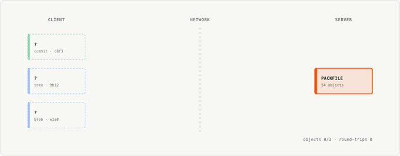
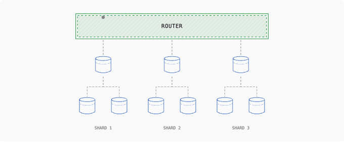
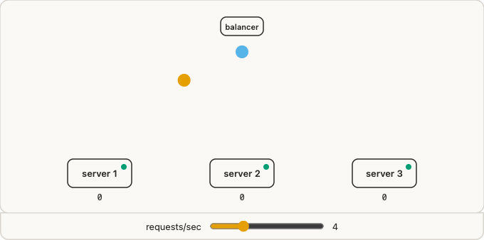
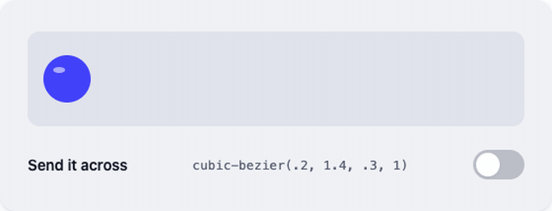
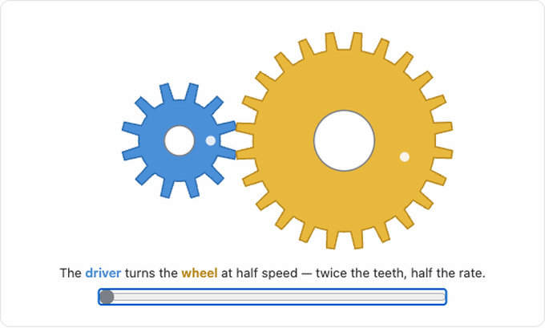

# blog-graphics

[](https://skills.sh/ChiragAgg5k/blog-graphics)

Agent skills for creating stunning animated graphics for technical blog posts — modeled on the design ideologies of engineering blogs that do this exceptionally well, reverse-engineered from their actual markup, CSS, and animation code.

Every graphic the skills produce is a **single self-contained HTML/SVG snippet**: no build step, no external libraries, no network requests, light/dark aware, `prefers-reduced-motion` compliant, and screenshot-verified before delivery.

## The style gallery

Recordings of each style's bundled `references/example.html` (the interactive ones are being driven by script — sliders scrubbed, toggles clicked):

| `style-cursor` — a client fetching git objects | `style-planetscale` — router fanning out to shards |
|---|---|
|  |  |

| `style-samwho` — round-robin load balancer toy | `style-comeau` — spring-easing playground |
|---|---|
|  |  |

| `style-ciechanowski` — slider-scrubbed meshing gears | |
|---|---|
|  | |

| Skill | Based on | Ideology | Best for |
|---|---|---|---|
| [`style-cursor`](skills/style-cursor/SKILL.md) | [cursor.com/blog](https://cursor.com/blog/git-at-any-scale) | Hairline schematics in tiny monospace caps; color means semantics, time means physics (24fps simulation clock, linear packet travel) | Infra, protocols, storage, systems |
| [`style-planetscale`](skills/style-planetscale/SKILL.md) | [planetscale.com/blog](https://planetscale.com/blog/massively-parallel-postgres-backups) | Dashed-inset boxes, database cylinders, Manhattan connectors with marching ants, no arrowheads — ambient loops or interactive labs | Databases, sharding, replication, parallelism |
| [`style-samwho`](skills/style-samwho/SKILL.md) | [samwho.dev](https://samwho.dev/load-balancing/) | Playful flat simulations in the Okabe-Ito colorblind-safe palette; the concept becomes a toy that runs forever | Algorithms, queues, load balancing |
| [`style-comeau`](skills/style-comeau/SKILL.md) | [joshwcomeau.com](https://www.joshwcomeau.com/) | Whimsical playgrounds on strict HSL design tokens; CSS transitions animate, JS only flips state | Frontend/CSS topics, tutorials |
| [`style-ciechanowski`](skills/style-ciechanowski/SKILL.md) | [ciechanow.ski](https://ciechanow.ski/mechanical-watch/) | "Lite" adaptation: slider-scrubbed mechanisms with mechanically correct ratios, prose color-linked to parts | Geometric/mechanical/continuous processes |

Each style skill carries the exact palette (hex values pulled from the live sites), typography, line weights, motion grammar, a step-by-step recipe, and a complete verified example in `references/example.html`. Users can ask to **copy a style exactly** or use one as a **remix base**.

## How it works

The core [`blog-graphics`](skills/blog-graphics/SKILL.md) skill is the entry point. It enforces a process designed to keep an AI agent on rails:

1. **One mechanism per graphic** — a written "This graphic shows ___ by animating ___" sentence before any code.
2. **Pick a style and commit fully** — half-applied styles look AI-generated; fully-applied ones look designed.
3. **Compose from known recipes** — `references/animation-techniques.md` covers flowing dashes, draw-on reveals, `offset-path` packets, single-timeline staged sequences, steppers, sliders, and the `transform-box` gotcha that breaks most AI-generated SVG.
4. **Storyboard in text, build, then verify with screenshots** — `scripts/screenshot.mjs` captures the animation at multiple timeline points in light and dark; frames must differ and each must be individually legible.
5. **Deliver per platform** — `references/embedding.md` covers MDX, Hugo/Jekyll, Ghost/WordPress, and GIF/MP4 fallbacks for platforms that strip HTML.

## Install

Via [skills.sh](https://skills.sh) — works with Claude Code, Cursor, Codex, OpenCode, and 70+ other agents:

```bash
# all six skills
npx skills add ChiragAgg5k/blog-graphics

# or just the styles you want (the core blog-graphics skill is recommended alongside any style)
npx skills add ChiragAgg5k/blog-graphics --skill blog-graphics --skill style-planetscale
```

Alternatively: as a Claude Code plugin (from a marketplace containing this repo), or copy the `skills/` directories into a project's `.claude/skills/`. Then:

```
/blog-graphic a diagram showing how our WAL ships segments to three replicas, PlanetScale style
```

or just ask: *"create an animated graphic for my post about consistent hashing — samwho style"*.

## Scripts

- `skills/blog-graphics/scripts/screenshot.mjs <file.html> [--at 0,1500,3000] [--dark]` — multi-frame screenshots via Playwright for motion verification.
- `skills/blog-graphics/scripts/preview.sh <file.html>` — serve and open a graphic locally.
